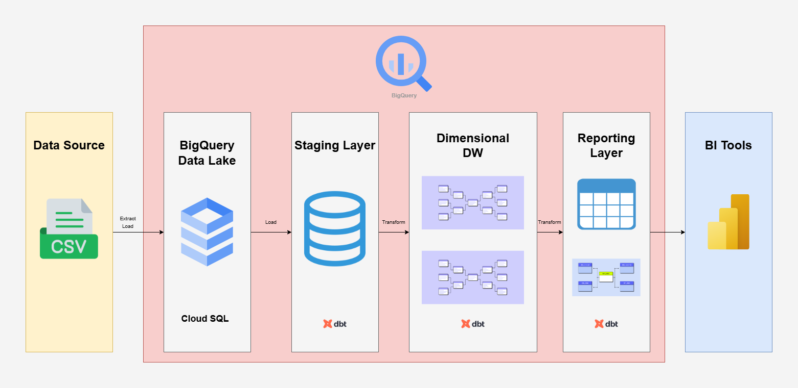
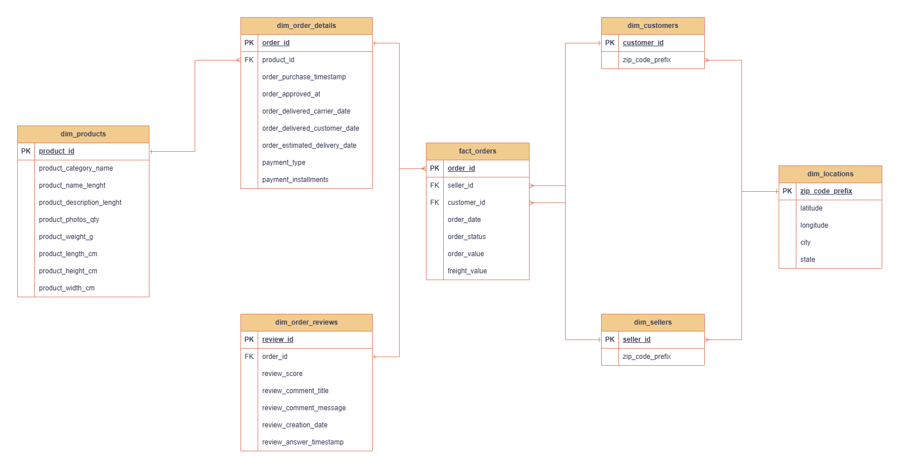
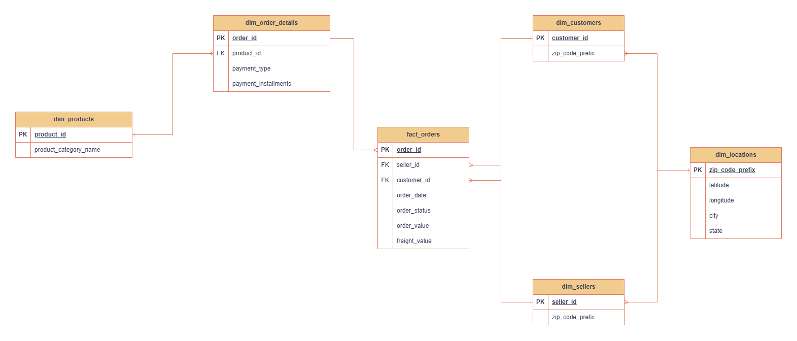
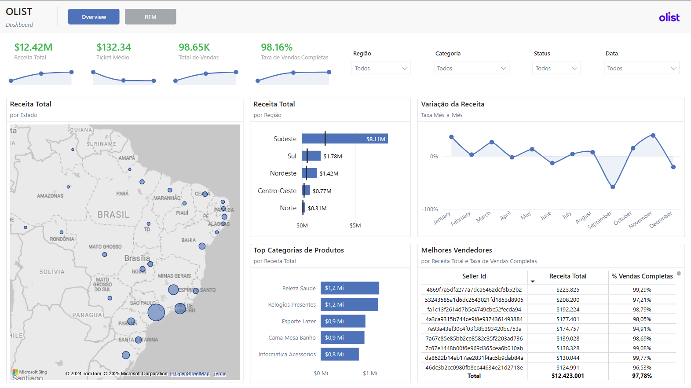
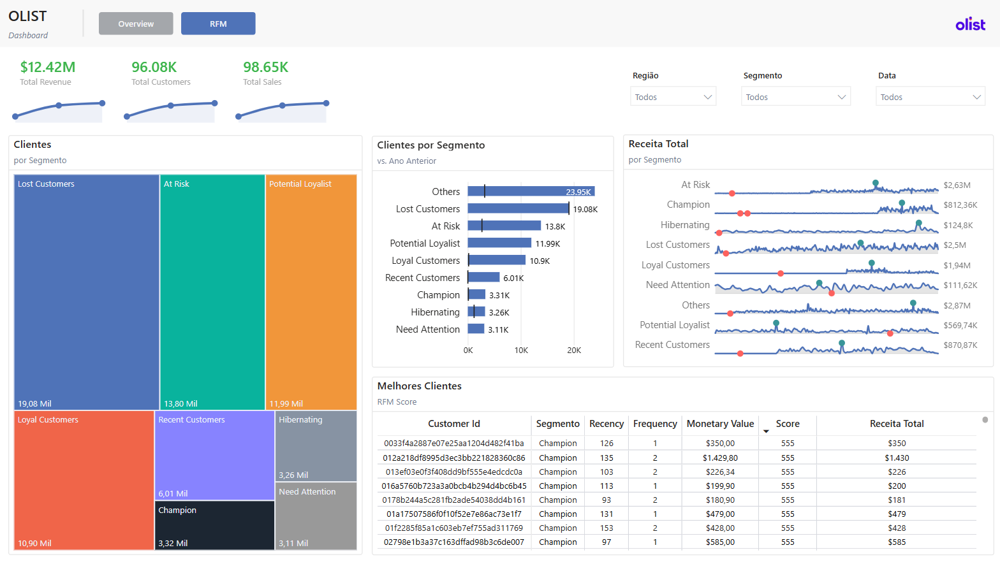

# Modelagem de Data Warehouse com o Brazilian E-Commerce Public Dataset by Olist


## 📌 Introdução
O *dataset* contém dados de transações realizadas por diversos pequenos negócios brasileiros cadastrados na plataforma de vendas para marketplace. Esses pequenos negócios conseguem, através da Olist Store, vender seus produtos diretamente e enviá-los por meio dos parceiros logísticos da Olist.

### Objetivos
Este projeto tem dois objetivos chave: a criação de um Data Warehouse utilizando o BigQuery, e um *dashboard* com um panorâma das vendas e uma análise RFM para segmentação de clientes.


## 🛠️ Ferramentas utilizadas
- Python 3.12^
- dbt-core 
- Google BigQuery
- Microsoft Power BI

## 📊 Dados


O dataset com os arquivos originais pode ser encontrado no [Kaggle](https://www.kaggle.com/datasets/olistbr/brazilian-ecommerce).

## ✅ Resultados
### Modelagem de Dados



Os dados originais estavam em arquivos .csv que foram enviados para o BigQuery. Na pasta `docs/` esta localizado o arquivo de Source to Target Mapping onde estão documentados todos os processos realizados na criação do Data Warehouse.

#### Staging Layer

Nessa camada foi realizada a carga dos arquivos brutos.

#### Dimensional Data Warehouse

Nessa camada, foram realizadas a limpeza e a manipulação dos dados, e o Data Warehouse foi modelado com tabelas fato e dimensão em um Snowflake Schema.



#### Reporting Layer


Nessa camada, foram criados dois Data Marts: o Sales Mart, para criar relatórios de acompanhamento da performance de vendas, e o RFM Mart, para a realização de segmentação e análises com o método RFM.

##### Mart Sales


##### Mart RFM 

|Coluna|Descrição|
|---|---|
|customer_id|Id do cliente|
|recency|Recência (dias)|
|frequency|Frequência|
|monetary|Valor monetário|
|r_score|Pontuação de recência|
|f_score|Potuação de frequência|
|m_score|Pontuação de valor monetário|
|rfm_score|Pontuação de RFM|
|customer_segment|Segmento do cliente|

##### Dashboard 




## ⚙️ Instalação e uso

Dashboard interativo no [Power BI Service](https://app.powerbi.com/view?r=eyJrIjoiNjM4MzViNzQtYzcyMy00MzJmLTgwODctNzViZTAxNjU1OTY3IiwidCI6ImJmOWUzNDgwLTkyM2UtNDNmMS04OTE1LTlmMmY3YjY2NTc0MSJ9).

##### Instalação do poetry

```bash
pip install poetry
```

##### Clonar repositório, instalar dependências e ativar ambiente virtual

```bash
git clone https://github.com/datalopes1/olist_dw.git
cd olist_dw
poetry install
poetry shell
```

##### Rodar os Modelos com dbt

```bash
dbt run
```

##### Rodar os testes com dbt

```bash
dbt test
```
## 📚 Licença
Este projeto é licenciado pela MIT License - veja o LICENSE.md para mais detalhes.

## 📞 Contato
- LinkedIn: https://www.linkedin.com/in/andreluizls1
- Portfolio: https://sites.google.com/view/datalopes1
- E-mail: datalopes1@proton.me
