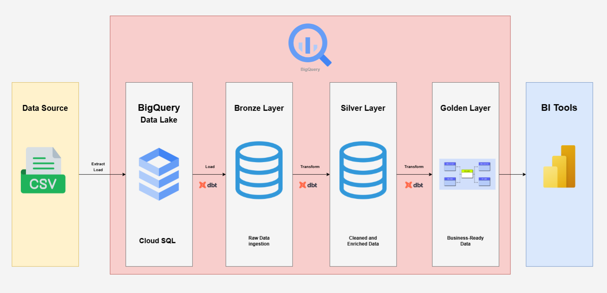
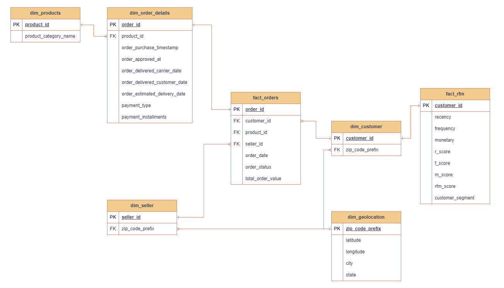

# Modelagem de Data Warehouse com o Brazilian E-Commerce Public Dataset by Olist


## 📌 Introdução
O *dataset* contém dados de transações realizadas por diversos pequenos negócios brasileiros cadastrados na plataforma de vendas para marketplace. Esses pequenos negócios conseguem, através da Olist Store, vender seus produtos diretamente e enviá-los por meio dos parceiros logísticos da Olist.

### Objetivos
Este projeto tem dois objetivos chave: a criação de um Data Warehouse utilizando o BigQuery, e um *dashboard* com um panorâma das vendas e uma análise RFM para segmentação de clientes.


## 🛠️ Ferramentas utilizadas
- Python 3.12^
- dbt-core 
- Google BigQuery
- Microsoft Power BI

## 📊 Dados


O dataset com os arquivos originais pode ser encontrado no [Kaggle](https://www.kaggle.com/datasets/olistbr/brazilian-ecommerce).

## ✅ Resultados
### Modelagem de Dados



#### Bronze Layer

Ingestão dos dados brutos em seu formato original. 

#### Silver Layer

Dados transformados, limpos e enriquecidos vindos da bronze layer.

#### Golden Layer

Dados *business-ready*. Os dados foram agregados para os uso de criação de dashboards e relatórios. Os dados foram armazenados em Star Schema.



<<<<<<< HEAD
##### Classificações do RFM
=======

Nessa camada, foram criados dois Data Marts: o Sales Mart, para criar relatórios de acompanhamento da performance de vendas, e o RFM Mart, para a realização de segmentação e análises com o método RFM.
>>>>>>> 6e0d0d49f5dc183bf4ddec5e7576545c24cdd75a

A segmentação RFM seguiu os seguintes critérios:

|Segmento|Descrição|RFM Score|
|---|---|---|
|Top Customers|Os melhores clientes|555, 554, 545, 455|
|Loayl Customers|Clientes com a maior recência|Todos com a recência 5|
|Big Spenders|Clientes com o maior valor moentário|Todos com valor monetário 5|
|Frequent Buyers|Clientes com a maior frequência|Todos com a frequência 5|
|Lost Customers|Clientes perdidos|111, 112, 121|
|Average Customers|Clientes normais|Restantes dos Scores|


## ⚙️ Instalação e uso

Dashboard interativo no [Power BI Service](https://app.powerbi.com/view?r=eyJrIjoiMGU5NDQ1ZmEtMzNhOC00OGU3LTk4OTktY2EyY2M3ZGVmMDUxIiwidCI6ImJmOWUzNDgwLTkyM2UtNDNmMS04OTE1LTlmMmY3YjY2NTc0MSJ9).

##### Instalação do poetry

```bash
pip install poetry
```

##### Clonar repositório, instalar dependências e ativar ambiente virtual

```bash
git clone https://github.com/datalopes1/olist_dw.git
cd olist_dw
poetry install
poetry shell
```

##### Rodar os Modelos com dbt

```bash
dbt run
```

##### Rodar os testes com dbt

```bash
dbt test
```
## 📚 Licença
Este projeto é licenciado pela MIT License - veja o LICENSE.md para mais detalhes.

## 📞 Contato
- LinkedIn: https://www.linkedin.com/in/andreluizls1
- Portfolio: https://sites.google.com/view/datalopes1
- E-mail: datalopes1@proton.me
